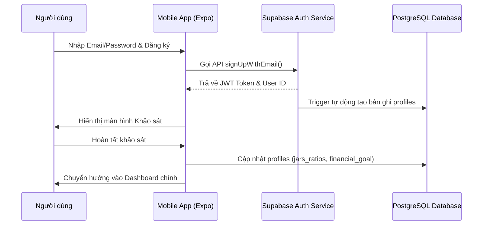

# Software Requirements Specification (SRS) - Authentication & Onboarding

## 1. System Architecture & Authentication Flow
Kiến trúc xác thực dựa trên giải pháp **Supabase Auth (JWT-based)** kết hợp lưu vết phiên đăng nhập cục bộ.



---

## 2. Database Schema Details

### 2.1 Bảng `public.profiles`
Lưu trữ thông tin hồ sơ người dùng liên kết trực tiếp với bảng hệ thống `auth.users`:

| Tên trường | Kiểu dữ liệu | Ràng buộc | Mô tả |
| :--- | :--- | :--- | :--- |
| `id` | UUID | PRIMARY KEY, REFERENCES auth.users(id) | ID duy nhất từ hệ thống Auth |
| `display_name` | TEXT | NOT NULL | Tên hiển thị của người dùng trên ứng dụng |
| `avatar_url` | TEXT | NULL | Đường dẫn ảnh đại diện |
| `jars_ratios` | JSONB | DEFAULT '{"NEC": 55, "LTSS": 10, "EDU": 10, "PLAY": 10, "FFA": 10, "GIVE": 5}' | Tỷ lệ phần trăm phân bổ của 6 hũ |
| `financial_goal` | TEXT | NULL | Mục tiêu tài chính cá nhân |
| `created_at` | TIMESTAMPTZ | DEFAULT NOW() | Thời gian tạo tài khoản |
| `updated_at` | TIMESTAMPTZ | DEFAULT NOW() | Thời gian cập nhật gần nhất |

---

## 3. APIs & Service Logic

### 3.1 Hàm Tạo Profile Tự động (Postgres Trigger)
Đảm bảo khi một tài khoản Auth được đăng ký thành công, một bản ghi tương ứng trong bảng `public.profiles` sẽ được sinh ra tự động:
```sql
CREATE OR REPLACE FUNCTION public.handle_new_user()
RETURNS TRIGGER AS $$
BEGIN
  INSERT INTO public.profiles (id, display_name, jars_ratios)
  VALUES (
    NEW.id,
    COALESCE(NEW.raw_user_meta_data->>'display_name', 'Thành viên Capy'),
    '{"NEC": 55, "LTSS": 10, "EDU": 10, "PLAY": 10, "FFA": 10, "GIVE": 5}'::jsonb
  );
  RETURN NEW;
END;
$$ LANGUAGE plpgsql SECURITY DEFINER;

CREATE OR REPLACE TRIGGER on_auth_user_created
  AFTER INSERT ON auth.users
  FOR EACH ROW EXECUTE FUNCTION public.handle_new_user();
```

### 3.2 Service Đăng ký & Lưu trữ Onboarding
*   `signUp(email, password, displayName)`: Đăng ký tài khoản trên Supabase Auth.
*   `submitOnboarding(userId, answers)`:
    *   Tính toán tỷ lệ hũ dựa trên câu trả lời.
    *   Thực hiện câu lệnh UPDATE cập nhật cột `jars_ratios` và `financial_goal` trong bảng `public.profiles`.

---

## 4. Security & Performance Constraints
*   **Bảo mật Token:** Lưu trữ Access Token và Refresh Token bảo mật trong bộ nhớ đệm an toàn của thiết bị (sử dụng Expo SecureStore hoặc AsyncStorage được mã hóa).
*   **Xác thực mật khẩu:** Mật khẩu tối thiểu 6 ký tự, bắt buộc chứa cả chữ và số để tăng tính bảo mật chống Brute Force.
*   **Rate Limiting:** Áp đặt giới hạn đăng ký tối đa 5 lần/giờ từ một địa chỉ IP để chống Spam tài khoản rác.
