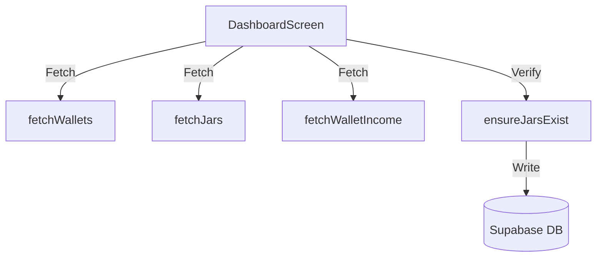

# Software Requirements Specification (SRS) - Dashboard

## 1. System Integration & Data Flow
Màn hình Dashboard đóng vai trò điều phối trung tâm dữ liệu tài chính của người dùng. Dữ liệu từ Supabase Cloud được tải về thông qua các hàm dịch vụ trong `dashboardService` và quản lý trạng thái tập trung.



---

## 2. API Specifications

### 2.1 API Lấy dữ liệu ví (`fetchWallets`)
*   **Tham số:** `userId: string`
*   **Mô tả:** Lấy danh sách ví mà người dùng sở hữu hoặc là thành viên ví chung (loại trừ ví đã xóa mềm `is_deleted = true`).
*   **Hành vi:**
    ```typescript
    const { data: memberRows } = await supabase
      .from('wallet_members')
      .select('wallet_id')
      .eq('user_id', userId);
    ```

### 2.2 API Đồng bộ hũ tài chính (`ensureJarsExist`)
*   **Tham số:** `walletId: string, currentJars: Jar[], userRatios: JSON`
*   **Hành vi:** Kiểm tra xem ví đã có đủ 6 hũ tài chính chưa. Nếu chưa đủ (ví dụ: ví chung mới tạo), hệ thống tự động sinh các hũ còn thiếu với số dư bằng 0đ và tỷ lệ phần trăm phân bổ dựa trên cấu hình mặc định.

---

## 3. Logic Mascot & Hạn Mức Chi Tiêu

### 3.1 Mascot Speech Generator
Gợi ý thoại ngẫu nhiên của Mascot Capy dựa trên thời gian thực tế của hệ thống và cảnh báo tài chính:
```typescript
export function getMascotSpeech(alertStatus: BudgetAlertStatus): string {
  if (alertStatus === BudgetAlertStatus.OVER_BUDGET) {
    return "Ối! Một số hũ đã vượt hạn mức rồi đấy! Hãy thắt chặt chi tiêu nhé! 🦦 Warning!";
  }
  if (alertStatus === BudgetAlertStatus.SPENDING_TOO_FAST) {
    return "Capy phát hiện bạn đang tiêu tiền hơi nhanh trong tháng này đấy! Cẩn thận nha! 🦦";
  }
  
  const hour = new Date().getHours();
  if (hour < 11) return "Buổi sáng năng lượng! Đừng quên ghi chép ly cà phê sáng nhé! ☕";
  if (hour < 14) return "Ăn trưa ngon miệng nha! Tiêu gì thì nhớ kể cho Capy nghe đấy! 🦦";
  return "Ghi chép mỗi ngày, tâm hồn thảnh thơi cùng Capy bạn nhé! ✨";
}
```

### 3.2 Bộ nhớ đệm Ví hoạt động gần nhất (Active Wallet Cache)
Để tránh việc người dùng phải chọn lại ví mỗi khi khởi động lại ứng dụng, hệ thống sử dụng AsyncStorage để lưu vết:
*   **Khóa:** `last_active_wallet_id_${userId}`
*   **Hành vi:** Mỗi khi người dùng đổi ví active trên Wallet Switcher, hệ thống gọi `AsyncStorage.setItem()` lưu ID ví mới. Khi mở app, hệ thống gọi `AsyncStorage.getItem()` làm tham số khởi tạo ban đầu cho State.
