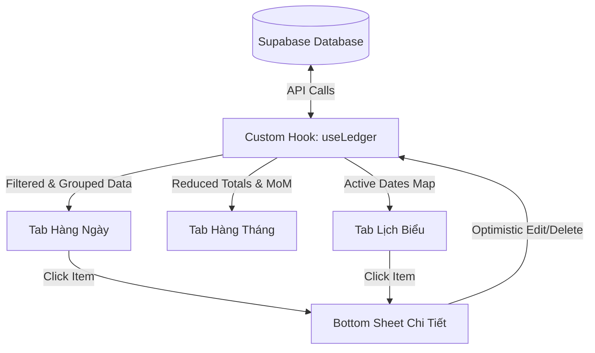

# Thiết Kế Chi Tiết Màn Sổ Giao Dịch (Ledger Screen)

Tài liệu này đặc tả chi tiết thiết kế giao diện, luồng dữ liệu, cấu trúc component và kế hoạch kiểm thử cho màn hình Sổ Giao Dịch (Ledger Screen) trong ứng dụng quản lý tài chính cá nhân Capy's Money.

---

## 1. Yêu Cầu Nghiệp Vụ & Thiết Kế UI/UX

Giao diện tuân thủ tuyệt đối các nguyên lý và token của thiết kế thương hiệu Capy's Money (phong cách Tactile mềm mại, bo tròn góc cực đại, phối màu pastel ấm áp).

### 1.1. Cấu trúc Layout (Tabbed View)
Màn hình được chia làm 3 tab điều hướng chính:
*   **Tab Hàng ngày (Daily):** Hiển thị danh sách các giao dịch được nhóm theo từng ngày. Có thẻ tóm tắt tổng Thu nhập, Chi tiêu và Số dư Net của tháng hiện tại.
*   **Tab Hàng tháng (Monthly):** Báo cáo trực quan chi tiêu. Phía trên là biểu đồ Donut (SVG) thể hiện phần trăm phân bổ chi tiêu của các Danh mục chính. Phía dưới là Thẻ MoM Comparison hiển thị so sánh chênh lệch chi tiêu với tháng trước đi kèm lời nhận xét, khuyên nhủ thân thiện từ chú Capy.
*   **Tab Lịch biểu (Calendar):** Hiển thị lưới lịch biểu diễn tháng hiện tại. Các ngày có phát sinh giao dịch sẽ hiển thị một chấm nhỏ (dot) dưới số ngày. Khi người dùng click vào một ngày bất kỳ, danh sách giao dịch chi tiết của ngày đó sẽ được tải ở khung bên dưới lịch.

### 1.2. Bộ lọc Ví (Wallet Selector)
*   Sổ giao dịch sẽ kế thừa ngữ cảnh Ví (Wallet Context) đang được chọn ở Dashboard ngoài màn hình chính.
*   Giao diện Sổ giao dịch sẽ có tiêu đề dạng Dropdown (ví dụ: `Ví Tiền mặt ▼`). Khi người dùng nhấn vào sẽ hiển thị một Bottom Sheet cho phép đổi nhanh sang Ví cá nhân khác hoặc Ví nhóm.

### 1.3. Chi tiết Giao dịch & Tương tác
*   Khi nhấn chọn bất kỳ giao dịch nào trên danh sách, một **Bottom Sheet Chi Tiết** sẽ trượt từ cạnh dưới lên.
*   Thông tin hiển thị bao gồm:
    *   Số tiền giao dịch (lớn, tô màu xanh cho Thu nhập, màu đỏ cho Chi tiêu).
    *   Hũ tài chính liên kết (NEC, PLAY, FFA, LTSS, EDU, GIVE).
    *   **Hạng mục con (Sub-category):** Phân cấp theo cấu trúc `Tên Hũ > Hạng mục cha > Hạng mục con` (Ví dụ: `Hũ Thiết yếu > Ăn uống > Ăn trưa`). Trường thông tin này sử dụng liên kết `parent_id` trong bảng `categories`.
    *   Thời gian, ghi chú, ví và người tạo.
    *   Hai nút hành động: **Sửa** (chuyển sang màn hình chỉnh sửa) và **Xóa** (hiển thị popup cảnh báo xác nhận trước khi thực thi).

---

## 2. Kiến Trúc & Luồng Dữ Liệu (Architecture & Data Flow)

Sử dụng phương án **Tổng hợp dữ liệu phía Client kết hợp Caching trong Custom Hook (Client-side Aggregation)**.



### 2.1. Custom Hook `useLedger`
Tất cả các logic gọi API Supabase và cache dữ liệu sẽ tập trung vào Custom Hook `useLedger(walletId, targetMonth)`.
*   **Truy vấn chính:** Lấy danh sách giao dịch có `wallet_id = walletId` và `occurred_at` nằm trong khoảng đầu tháng đến cuối tháng của `targetMonth`. Sử dụng `.select('*, categories(*)')` để join bảng categories lấy đầy đủ thông tin danh mục cha con.
*   **Truy vấn phụ (Lazy):** Lấy tổng số tiền chi tiêu của tháng liền trước (`targetMonth - 1 month`) để hiển thị thông tin so sánh MoM tại Tab Hàng tháng.
*   **Giá trị trả về:**
    ```typescript
    interface UseLedgerResult {
      transactions: Transaction[];
      isLoading: boolean;
      error: string | null;
      refetch: () => Promise<void>;
      deleteTransaction: (id: string) => Promise<boolean>;
      updateTransaction: (id: string, data: Partial<Transaction>) => Promise<boolean>;
    }
    ```

### 2.2. Optimistic Updates (Cập nhật giao diện tức thời)
*   **Khi Xóa:** Khi gọi `deleteTransaction(id)`, hook sẽ lưu trữ tạm thời giao dịch bị xóa vào bộ nhớ đệm dự phòng (rollback state). Sau đó lập tức cập nhật state `transactions` cục bộ bằng cách lọc bỏ giao dịch đó. UI sẽ lập tức biến mất giao dịch mà không cần đợi API hoàn tất. Nếu API Supabase trả về lỗi, hook sẽ đẩy lại giao dịch cũ vào state và hiển thị Toast thông báo lỗi.
*   **Khi Sửa:** Tương tự, thông tin mới sẽ được ghi đè lên state cục bộ lập tức và hoàn tác về bản cũ nếu API cập nhật trên Supabase gặp lỗi mạng.

---

## 3. Cấu Trúc Component Chi Tiết

Tất cả các component sẽ được viết bằng TypeScript và React Native Expo:

1.  `src/screens/LedgerScreen.tsx`
    *   Màn hình chính chứa cấu trúc khung, xử lý chuyển đổi các Tab (`activeTab` state) và Wallet Selector Dropdown.
    *   Sử dụng Custom Hook `useLedger` để quản lý trạng thái dữ liệu.
2.  `src/components/ledger/DailyTab.tsx`
    *   Nhận danh sách giao dịch, xử lý gom nhóm theo ngày ở client qua hàm `groupTransactionsByDay(transactions)`.
    *   Hiển thị danh sách cuộn mượt bằng `FlatList`.
3.  `src/components/ledger/MonthlyTab.tsx`
    *   Nhận dữ liệu giao dịch và tổng chi tiêu tháng trước từ hook.
    *   Tính toán tỷ lệ phần trăm phân bổ danh mục. Vẽ biểu đồ Donut bằng SVG của React Native.
    *   Hiển thị thẻ nhận xét thông minh so sánh dòng tiền MoM.
4.  `src/components/ledger/CalendarTab.tsx`
    *   Xây dựng lưới Grid lịch 7 cột. Tạo `Set` lưu các ngày chứa giao dịch để hiển thị chấm tròn.
    *   Cho phép bấm chọn ngày cụ thể để lọc danh sách hiển thị phía dưới lịch.
5.  `src/components/ledger/TransactionDetailSheet.tsx`
    *   Bottom Sheet hiển thị đầy đủ thông tin giao dịch, định dạng số tiền theo chuẩn VNĐ và kết xuất chuỗi phân cấp Hạng mục con.

---

## 4. Kế Hoạch Kiểm Thử & Xử Lý Lỗi (Testing & Error Handling)

### 4.1. Kịch bản Unit Test (TDD - Đạt độ bao phủ >= 80%)
*   **Bộ lọc danh sách:**
    *   Kiểm thử hàm `groupTransactionsByDay` gom nhóm chính xác theo ngày, sắp xếp giao dịch mới nhất lên trên.
    *   Kiểm thử hàm tính toán Donut chart xử lý chính xác trường hợp không có giao dịch chi tiêu trong tháng (không gây lỗi chia cho 0).
*   **Custom Hook `useLedger`:**
    *   Mock Supabase Client phản hồi dữ liệu thành công.
    *   Mock Supabase Client phản hồi lỗi mạng và hook ghi nhận trạng thái `error` chính xác.
    *   Kiểm thử luồng Optimistic Update: Xóa giao dịch thành công (state giảm ngay), Xóa giao dịch thất bại (state tự động khôi phục giao dịch cũ).

### 4.2. Xử lý lỗi & Trạng thái biên (Edge Cases)
*   **Trạng thái rỗng (Empty State):** Khi tháng được chọn chưa có giao dịch nào, hiển thị minh họa Capy dễ thương kèm dòng chữ "Tháng này chưa có chi tiêu nào, bạn thật tiết kiệm! 🦫".
*   **Trạng thái Lỗi mạng:** Hiển thị nút "Thử lại" (Retry) gọi trực tiếp hàm `refetch` từ hook.
*   **Lỗi cập nhật:** Hiển thị Toast thông báo chi tiết khi thao tác Sửa/Xóa thất bại để người dùng biết hành động chưa được đồng bộ lên Cloud.
