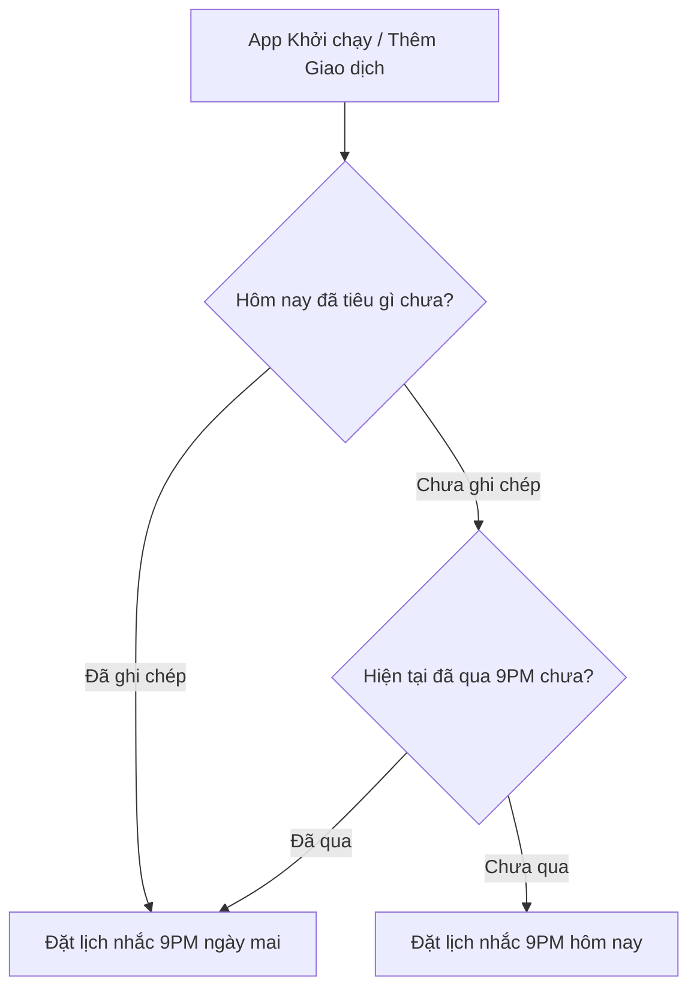

# Product Requirements Document (PRD) - Daily Reminder Notifications

## 1. Yêu cầu Giao diện & Trải nghiệm (UI/UX)
*   **Hỏi quyền thông báo (Permissions Request):**
    *   Màn hình Trang chủ (Dashboard) chủ động hỏi quyền gửi thông báo khi người dùng truy cập lần đầu.
    *   Nếu bị từ chối, hiển thị hướng dẫn nhỏ trong Cài đặt để người dùng mở lại khi cần.
*   **Nội dung thông báo (Notification Content):**
    *   *Tiêu đề:* "🦦 Hôm nay tiêu gì thế bạn ơi?"
    *   *Nội dung:* "Capy đang đợi bạn ghi chép chi tiêu cuối ngày để cập nhật các hũ tài chính đây! Nhấp vào để ghi nhanh nhé. ✨"

## 2. Quy trình Nghiệp vụ Sản phẩm

*   Hệ thống tự động hủy lịch nhắc cũ (nếu có) và lên lịch mới mỗi khi trạng thái giao dịch thay đổi, đảm bảo tính cập nhật và chính xác nhất.
