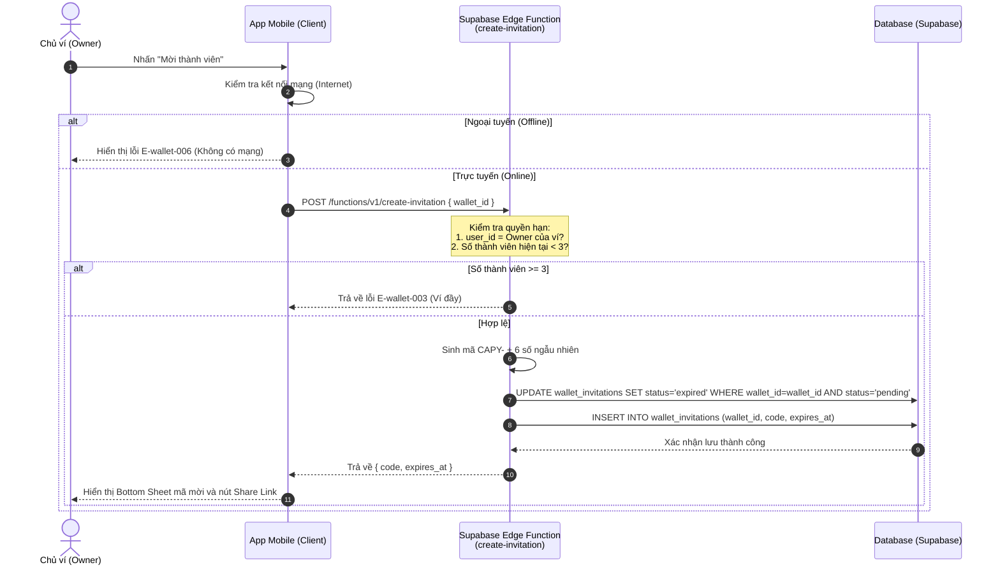
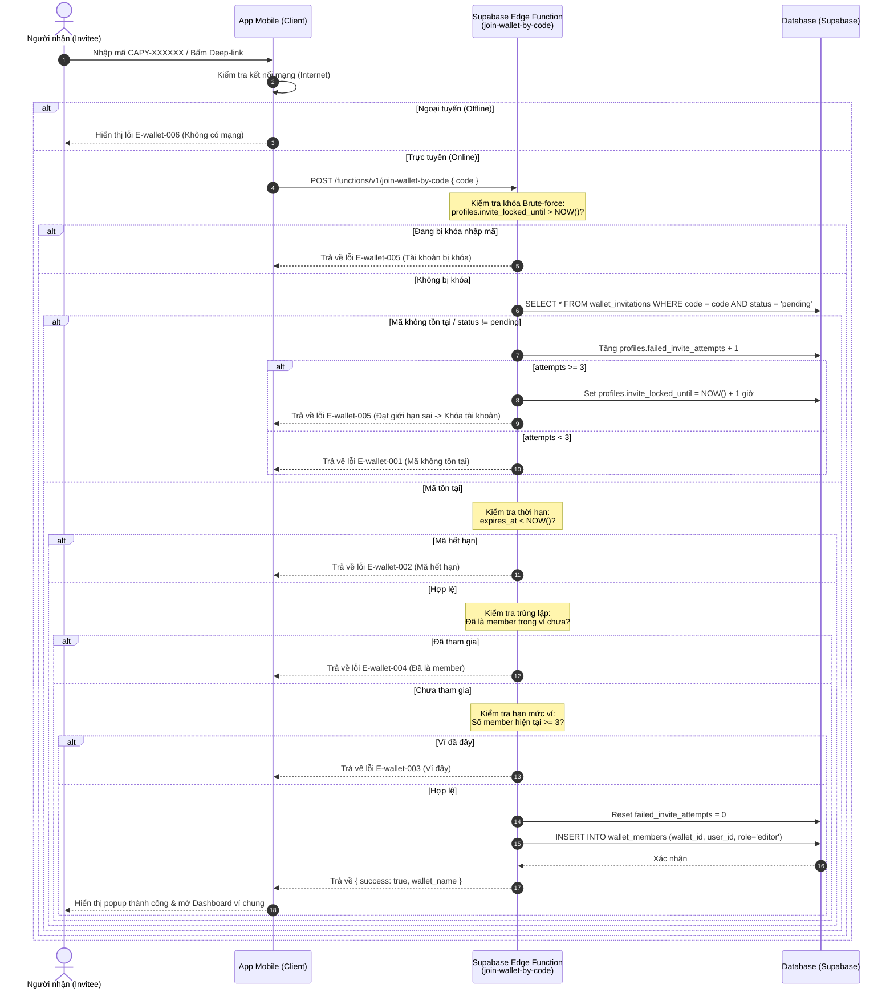

# Software Requirements Specification (SRS) — Shared Wallet Invitation

Tài liệu đặc tả kỹ thuật chi tiết cho tính năng mời thành viên tham gia ví chung của Capy's Money.

---

## 1. Kiến trúc luồng hệ thống (System Flows)

### 1.1 Luồng sinh mã mời (Generate Invite Code)


### 1.2 Luồng xác thực & Tham gia ví (Join Wallet Flow)


---

## 2. Yêu cầu chức năng (Functional Requirements)

### [[docs/design/wallet/prd-shared-wallet-invite.md#US-01|FR-wallet-001]]: Sinh mã mời (Generate Invite Code)
* **Mô tả**: Cho phép chủ ví tạo mã mời mới.
* **Đầu vào**: `wallet_id` (UUID).
* **Xử lý**:
  1. Xác thực người dùng hiện tại là Owner của ví chung.
  2. Tạo mã mời dạng: `"CAPY-"` ghép với chuỗi 6 ký tự số ngẫu nhiên (ví dụ: `CAPY-492048`).
  3. Kiểm tra tính trùng lặp của mã trong DB (nếu trùng, sinh lại mã khác).
  4. Đặt thời gian hết hạn `expires_at = NOW() + INTERVAL '24 hours'`.
  5. Cập nhật các mã mời cũ của ví này có trạng thái `pending` chuyển thành `expired`.
  6. Lưu bản ghi mới vào cơ sở dữ liệu.
* **Đầu ra**: Trả về mã mời dạng chuỗi và thời gian hết hạn.

### [[docs/design/wallet/prd-shared-wallet-invite.md#US-03|FR-wallet-002]]: Xác thực mã mời (Verify Invite Code)
* **Mô tả**: Kiểm tra tính hợp lệ của mã mời khi người dùng quét link hoặc nhập tay.
* **Đầu vào**: `code` (String).
* **Xử lý**:
  1. Tìm kiếm trong bảng `wallet_invitations` dòng có `code` trùng khớp và `status = 'pending'`.
  2. Nếu không tìm thấy, tăng bộ đếm nhập sai của người dùng.
  3. Nếu tìm thấy, kiểm tra xem `expires_at` đã qua chưa. Nếu qua, trả về lỗi mã hết hạn.
  4. Kiểm tra xem ví chung đích đã đạt tối đa 3 thành viên hay chưa.
* **Đầu ra**: Thông tin ví (Tên ví, Tên chủ ví) nếu mã hợp lệ.

### [[docs/design/wallet/prd-shared-wallet-invite.md#US-04|FR-wallet-003]]: Tham gia ví chung (Join Wallet)
* **Mô tả**: Thêm người dùng được mời vào ví chung làm thành viên chỉnh sửa.
* **Đầu vào**: `code` (String).
* **Xử lý**:
  1. Xác thực lại tính hợp lệ của mã tương tự `FR-wallet-002`.
  2. Thêm bản ghi mới vào bảng `wallet_members` với `wallet_id`, `user_id = auth.uid()`, và `role = 'editor'`.
  3. Reset bộ đếm lỗi `failed_invite_attempts` của người dùng về 0.
  4. Gửi một bản ghi log thông báo (Push Notification) đến chủ ví.
* **Đầu ra**: Trả về kết quả thành công và chuyển hướng sang Dashboard ví chung.

### [[docs/design/wallet/prd-shared-wallet-invite.md#US-05|FR-wallet-004]]: Xóa thành viên (Remove Member)
* **Mô tả**: Chủ ví xóa thành viên (Editor) ra khỏi ví chung.
* **Đầu vào**: `wallet_id` (UUID), `user_id` (UUID).
* **Xử lý**:
  1. Xác thực người dùng hiện tại là Owner của ví.
  2. Xóa bản ghi tương ứng trong bảng `wallet_members`.
  3. Giữ nguyên toàn bộ bản ghi giao dịch trong bảng `transactions` có `created_by = user_id` và `wallet_id = wallet_id`. Chỉ thu hồi quyền truy cập.
* **Đầu ra**: Trả về kết quả thành công.

---

## 3. Yêu cầu phi chức năng (Non-Functional Requirements)

### NFR-wallet-001: Tốc độ xử lý (Performance)
* Thời gian phản hồi API sinh mã mời và kiểm tra mã mời phải dưới **500ms** trong điều kiện mạng bình thường.
* Thao tác cập nhật phân quyền thành viên và tải lại ví trên giao diện người dùng nhận phải hoàn thành dưới **1 giây**.

### NFR-wallet-002: Bảo mật brute-force (Security Rate-Limiting)
* Để bảo mật mã mời 6 số, hệ thống sẽ thực hiện khóa quyền nhập mã của tài khoản nếu nhập sai **3 lần liên tiếp** trong 1 tiếng.
* Thời gian khóa được quản lý trên server qua trường `profiles.invite_locked_until`.

### NFR-wallet-003: Quy định RLS (Row Level Security)
* Chỉ thành viên có trong bảng `wallet_members` (hoặc chủ ví trong `wallets`) mới được truy cập dữ liệu của ví chung thông qua RLS policies.

---

## 4. Quy tắc nghiệp vụ (Business Rules)

| ID | Tên quy tắc | Nội dung quy tắc |
|---|---|---|
| **BR-wallet-001** | Thời gian hết hạn | Mã mời có thời gian sống (TTL) chính xác là **24 giờ** kể từ lúc tạo. |
| **BR-wallet-002** | Giới hạn thành viên | Một ví chung chỉ có tối đa **3 thành viên** hoạt động cùng lúc (Owner + 2 Editors). |
| **BR-wallet-003** | Khóa Brute-force | Tự động khóa tài khoản thử mã sai 3 lần trong **60 phút**. |
| **BR-wallet-004** | Giới hạn mã active | Mỗi ví chung chỉ được tồn tại **tối đa 1 mã mời** ở trạng thái `pending` tại bất kỳ thời điểm nào. |

---

## 5. Ma trận mã lỗi (Error Code Matrix)

| Mã lỗi | HTTP Status | Thông báo nghiệp vụ hiển thị cho người dùng |
|---|---|---|
| **E-wallet-001** | 404 Not Found | `"Mã mời không tồn tại. Vui lòng kiểm tra lại."` |
| **E-wallet-002** | 410 Gone | `"Mã mời này đã hết hạn. Vui lòng yêu cầu chủ ví gửi mã mới."` |
| **E-wallet-003** | 400 Bad Request | `"Ví đã đầy, vui lòng liên hệ chủ ví."` |
| **E-wallet-004** | 409 Conflict | `"Bạn đã tham gia ví chung này rồi."` |
| **E-wallet-005** | 423 Locked | `"Bạn đã nhập sai mã quá nhiều lần. Vui lòng thử lại sau 1 tiếng."` |
| **E-wallet-006** | 0 Client Error | `"Tính năng này cần kết nối Internet. Vui lòng kiểm tra lại kết nối của bạn."` |

---

## 6. Thay đổi Cấu trúc Cơ sở dữ liệu (Database Schema Updates)

### 6.1 Bảng `wallet_invitations` (Sửa đổi)
* Sửa cột `invited_email` thành `NULLABLE` (vì không cần nhập email khi mời).
* Sửa cột `expires_at` mặc định thành `NOW() + INTERVAL '24 hours'`.
* Thêm cột `code` dạng `VARCHAR(12)` có chỉ mục `UNIQUE` để lưu mã mời dễ đọc `CAPY-XXXXXX`.
* Cột `role` mặc định là `'editor'`.

```sql
-- SQL thay đổi bảng wallet_invitations
ALTER TABLE public.wallet_invitations 
  ALTER COLUMN invited_email DROP NOT NULL,
  ALTER COLUMN expires_at SET DEFAULT (NOW() + INTERVAL '24 hours');

-- Thêm cột code nếu chưa có
ALTER TABLE public.wallet_invitations 
  ADD COLUMN IF NOT EXISTS code VARCHAR(12) UNIQUE;
```

### 6.2 Bảng `profiles` (Bổ sung cột quản lý brute-force)
* Thêm hai cột mới để theo dõi số lần thử mã sai và thời gian mở khóa.

```sql
-- SQL bổ sung trường quản lý brute-force cho bảng profiles
ALTER TABLE public.profiles 
  ADD COLUMN IF NOT EXISTS failed_invite_attempts INT DEFAULT 0,
  ADD COLUMN IF NOT EXISTS invite_locked_until TIMESTAMPTZ DEFAULT NULL;
```
