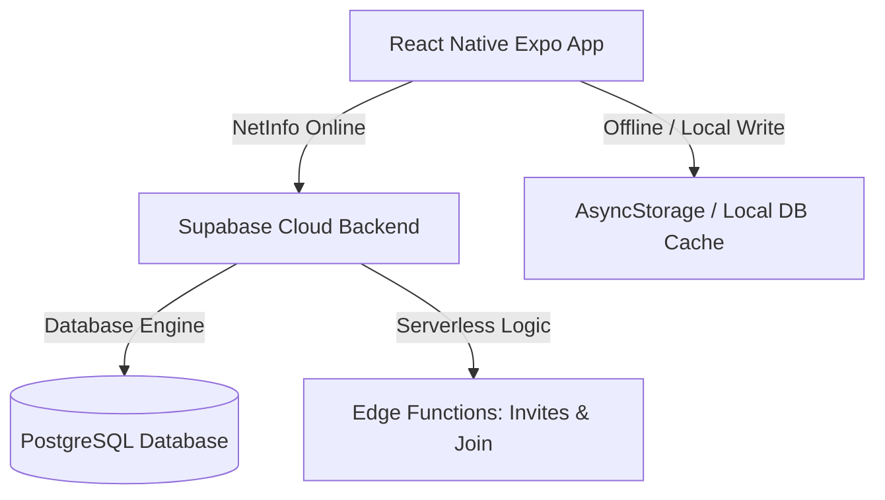

# Software Requirements Specification (SRS) - Capy's Money

## 1. System Architecture
Hệ thống Capy's Money tuân thủ mô hình **Client-Server** với kiến trúc đồng bộ hóa ngoại tuyến (Offline-first / Hybrid Sync) bảo đảm khả năng hoạt động ngay cả khi không có kết nối internet:



*   **Front-end:** React Native Expo (v54), TypeScript.
*   **Back-end:** Supabase (Bao gồm PostgreSQL, Auth, Database Triggers, Row-Level Security, Edge Functions).
*   **Local Storage:** AsyncStorage dùng để lưu vết phiên đăng nhập, ví hoạt động cuối cùng (`last_active_wallet_id`), và hàng đợi đồng bộ.

---

## 2. Database Schema (Bản vẽ thực tế)

### 2.1 Bảng `public.profiles`
Lưu trữ thông tin người dùng được liên kết tự động từ `auth.users`:
```sql
CREATE TABLE public.profiles (
  id UUID PRIMARY KEY REFERENCES auth.users(id) ON DELETE CASCADE,
  display_name TEXT,
  avatar_url TEXT,
  jars_ratios JSONB DEFAULT '{"NEC": 55, "LTSS": 10, "EDU": 10, "PLAY": 10, "FFA": 10, "GIVE": 5}'::jsonb,
  financial_goal TEXT,
  created_at TIMESTAMPTZ DEFAULT NOW(),
  updated_at TIMESTAMPTZ DEFAULT NOW()
);
```

### 2.2 Bảng `public.wallets`
Quản lý ví tài chính cá nhân và ví chung:
```sql
CREATE TABLE public.wallets (
  id UUID PRIMARY KEY DEFAULT gen_random_uuid(),
  user_id UUID NOT NULL REFERENCES public.profiles(id) ON DELETE CASCADE,
  name VARCHAR(32) NOT NULL,
  balance NUMERIC(15, 2) DEFAULT 0.00,
  type VARCHAR(16) DEFAULT 'personal', -- 'personal', 'shared'
  color VARCHAR(10) DEFAULT '#FFB7C5',
  icon VARCHAR(32) DEFAULT 'wallet-outline',
  is_default BOOLEAN DEFAULT FALSE,
  is_deleted BOOLEAN DEFAULT FALSE, -- Cờ xóa mềm (Soft delete)
  created_at TIMESTAMPTZ DEFAULT NOW(),
  updated_at TIMESTAMPTZ DEFAULT NOW()
);
```

### 2.3 Bảng `public.wallet_members`
Liên kết thành viên tham gia ví chung:
```sql
CREATE TABLE public.wallet_members (
  wallet_id UUID REFERENCES public.wallets(id) ON DELETE CASCADE,
  user_id UUID REFERENCES public.profiles(id) ON DELETE CASCADE,
  role VARCHAR(16) DEFAULT 'editor', -- 'owner', 'editor', 'viewer'
  joined_at TIMESTAMPTZ DEFAULT NOW(),
  PRIMARY KEY (wallet_id, user_id)
);
```

### 2.4 Bảng `public.jars`
Lưu trữ thông tin 6 hũ tài chính của từng ví:
```sql
CREATE TABLE public.jars (
  id UUID PRIMARY KEY DEFAULT gen_random_uuid(),
  wallet_id UUID NOT NULL REFERENCES public.wallets(id) ON DELETE CASCADE,
  type VARCHAR(8) NOT NULL, -- 'NEC', 'FFA', 'EDU', 'PLAY', 'LTSS', 'GIVE'
  budget_limit NUMERIC(15, 2) DEFAULT 0.00,
  spent_amount NUMERIC(15, 2) DEFAULT 0.00,
  allocation_percentage INTEGER NOT NULL CHECK (allocation_percentage >= 0 AND allocation_percentage <= 100),
  created_at TIMESTAMPTZ DEFAULT NOW(),
  updated_at TIMESTAMPTZ DEFAULT NOW(),
  UNIQUE (wallet_id, type)
);
```

### 2.5 Bảng `public.transactions`
Danh sách giao dịch thu/chi:
```sql
CREATE TABLE public.transactions (
  id UUID PRIMARY KEY DEFAULT gen_random_uuid(),
  wallet_id UUID NOT NULL REFERENCES public.wallets(id) ON DELETE CASCADE,
  category_id UUID,
  jar_type VARCHAR(8) NOT NULL, -- Hũ liên kết giao dịch
  amount NUMERIC(15, 2) NOT NULL,
  type VARCHAR(16) NOT NULL, -- 'income', 'expense', 'transfer'
  note TEXT,
  occurred_at TIMESTAMPTZ DEFAULT NOW(),
  created_by UUID REFERENCES public.profiles(id),
  created_at TIMESTAMPTZ DEFAULT NOW()
);
```

---

## 3. Database Triggers & Security Rules (RLS)

### 3.1 RLS Rule cho `wallet_members` & `wallets`
Mọi truy cập dữ liệu ví phải thông qua chính sách Row-Level Security nghiêm ngặt:
*   Người dùng chỉ được đọc ví nếu:
    `user_id = auth.uid()` HOẶC `id IN (SELECT wallet_id FROM wallet_members WHERE user_id = auth.uid())`.
*   Người dùng chỉ được cập nhật tỷ lệ hũ hoặc đổi tên ví nếu có vai trò `owner` hoặc `editor`. Vai trò `viewer` chỉ có quyền đọc (`SELECT`), mọi hành vi ghi (`UPDATE`, `INSERT`, `DELETE`) bị chặn ở mức Database.

### 3.2 Database Trigger kiểm tra hạn mức gói Free
Ràng buộc quota được bảo vệ bởi trigger database để tránh việc người dùng gian lận gọi API ngoài:
```sql
CREATE OR REPLACE FUNCTION check_free_tier_wallet_limits()
RETURNS TRIGGER AS $$
DECLARE
  v_personal_count INT;
  v_shared_count INT;
BEGIN
  -- Chỉ áp dụng kiểm tra khi tạo ví mới
  IF TG_OP = 'INSERT' THEN
    -- Đếm số ví cá nhân hiện tại của user (không bao gồm ví bị xóa)
    SELECT COUNT(*) INTO v_personal_count 
    FROM public.wallets 
    WHERE user_id = NEW.user_id AND type = 'personal' AND is_deleted = FALSE;

    -- Đếm số ví chung hiện tại của user sở hữu
    SELECT COUNT(*) INTO v_shared_count 
    FROM public.wallets 
    WHERE user_id = NEW.user_id AND type = 'shared' AND is_deleted = FALSE;

    -- Nếu vượt quá 2 ví cá nhân, chặn insert
    IF NEW.type = 'personal' AND v_personal_count >= 2 THEN
      RAISE EXCEPTION 'Vượt quá giới hạn ví cá nhân cho phép của gói miễn phí (tối đa 2).';
    END IF;

    -- Nếu vượt quá 1 ví chung, chặn insert
    IF NEW.type = 'shared' AND v_shared_count >= 1 THEN
      RAISE EXCEPTION 'Vượt quá giới hạn ví chung cho phép của gói miễn phí (tối đa 1).';
    END IF;
  END IF;
  RETURN NEW;
END;
$$ LANGUAGE plpgsql;

CREATE TRIGGER trigger_check_wallet_limits
BEFORE INSERT ON public.wallets
FOR EACH ROW EXECUTE FUNCTION check_free_tier_wallet_limits();
```

---

## 4. Synchronization Strategy (Đồng bộ Offline-first)
*   **Đọc dữ liệu:** Khi khởi động màn hình, app kiểm tra mạng bằng `NetInfo`.
    *   *Có mạng:* Đồng bộ dữ liệu mới nhất từ Supabase Cloud xuống bộ nhớ đệm thiết bị và hiển thị.
    *   *Mất mạng:* Đọc trực tiếp dữ liệu từ bộ nhớ cache cục bộ để kết xuất UI tức thì.
*   **Ghi dữ liệu (Ví dụ: Thêm giao dịch, thay đổi tỷ lệ hũ):**
    *   Thực hiện cập nhật số dư, số tiền đã tiêu cục bộ lập tức (Optimistic Update).
    *   Nếu mất mạng, đẩy hành động vào một hàng đợi đồng bộ ngầm (`sync_queue` lưu ở AsyncStorage) có trạng thái `pending`.
    *   Khi `NetInfo` báo thiết bị Online trở lại, ứng dụng tự động duyệt `sync_queue` để thực thi tuần tự các API request lên Supabase Cloud và chuyển trạng thái hàng đợi thành `synced`.
*   **Xóa ví:** Tuyệt đối không gọi câu lệnh `DELETE` cứng trên DB. Thay vào đó cập nhật cờ `is_deleted = true`. Việc này giúp hệ thống đồng bộ nhận diện được thay đổi trạng thái và không bị xung đột khóa ngoại với các bảng giao dịch cũ.

---

## 5. System Quality Requirements
*   **Performance:**
    *   Tốc độ tải dữ liệu và hiển thị danh sách ví khi khởi động nhỏ hơn `1.2s`.
    *   Màn hình Sổ giao dịch thực hiện lọc ví và chuyển tab con (Ngày, Tháng, Lịch) tức thì (< `100ms`) nhờ tính toán cache client-side thông qua `useMemo`.
*   **Reliability:**
    *   Ghi chép giao dịch bảo đảm tính toàn vẹn số dư ví chính xác đến từng chữ số thập phân (`NUMERIC(15,2)`).
    *   Phân bổ giao dịch thu nhập tự động nhân tỷ lệ % chia đều vào 6 hũ tương ứng chính xác tuyệt đối.
